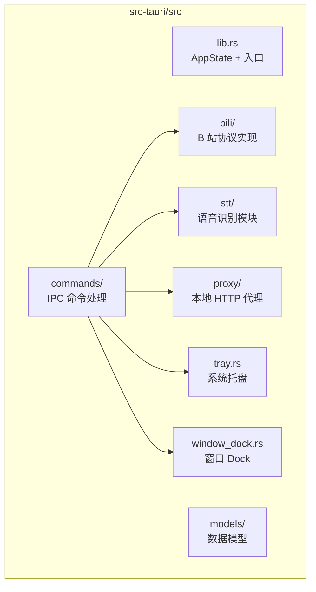
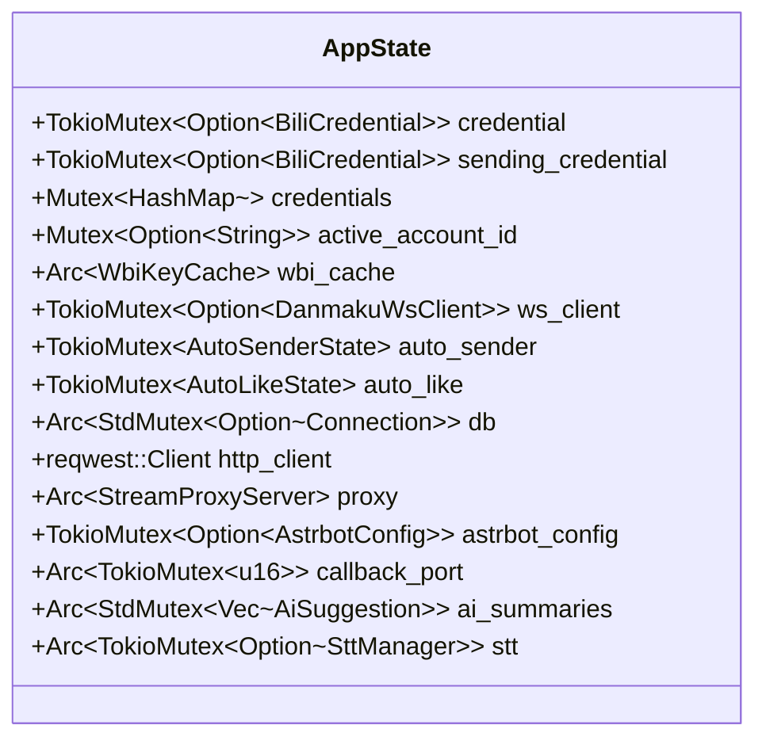

# 后端架构

BiliDanmu 的后端基于 **Rust** 构建，通过 Tauri 提供 IPC 命令与事件机制与前端通信。

## 技术选型

| 领域 | 技术 | 说明 |
| --- | --- | --- |
| HTTP 客户端 | reqwest | 调用 B 站 API |
| WebSocket | tokio-tungstenite | 实时弹幕连接 |
| 压缩 | brotli, flate2 | 处理 B 站压缩响应 |
| 音频解码 | symphonia 0.6 | AAC 解码（用于 STT） |
| 语音识别 | sherpa-onnx 1.13 | 流式语音识别 |
| 数据库 | rusqlite | SQLite 操作 |
| 代理 | hyper 1.x | 本地 HTTP 代理 |
| 异步运行时 | tokio | 异步任务调度 |

## 模块划分

### B 站协议 (`src/bili/`)

| 文件 | 说明 |
| --- | --- |
| `credential.rs` | Cookie 解析、SESSDATA 百分比编码、验证 |
| `wbi.rs` | WBI 签名（MIXIN_KEY_ENC_TAB + MD5）、密钥缓存 |
| `protocol.rs` | 16 字节大端序包头、Brotli/zlib 解压、消息解析 |
| `ws_client.rs` | WebSocket 客户端（认证、心跳、自动重连） |
| `api.rs` | `BiliApiClient` 封装共享 HTTP 客户端 |
| `buvid.rs` | 随机 hex + 时间戳生成 buvid3/buvid4 |

### IPC 命令 (`src/commands/`)

每个命令对应前端可调用的一个函数，按领域划分：

| 模块 | 说明 |
| --- | --- |
| `auth.rs` | 账号登录、切换、刷新 |
| `room.rs` | 房间搜索、添加、移除、表情 |
| `danmaku.rs` | 弹幕发送、自动发送、自动点赞 |
| `ai_proxy.rs` | AI 助手代理配置、触发、学习 |
| `settings.rs` | 设置读写 |
| `stt.rs` | 语音识别控制 |
| `proxy.rs` | 图片代理、缓存 |
| `download.rs` | 文件下载 |
| `log.rs` | 日志目录 |
| `message_template.rs` | 消息模板 |
| `selections.rs` | 选项持久化 |
| `update.rs` | 更新检查 |
| `websocket.rs` | WebSocket 连接 |

### 数据模型 (`src/models/`)

所有结构体使用 `serde(rename_all = "camelCase")` 与前端类型对齐。

### 语音识别 (`src/stt/`)

| 文件 | 说明 |
| --- | --- |
| `pipeline.rs` | 主流程：FLV 解复用 → AAC 解码 → 重采样 → sherpa-onnx 识别 |
| `flv_demux.rs` | FLV 解复用器，提取 AAC 帧，封装 ADTS 头 |
| `mod.rs` | `SttManager` 生命周期管理 |

### 本地代理 (`src/proxy/stream_proxy.rs`)

- 基于 hyper 1.x 的 HTTP 代理
- 随机端口，`OnceCell` 懒初始化
- 字节流 tee 到 STT 管道

### 系统托盘 (`src/tray.rs`)

- 托盘图标与菜单
- 单击切换窗口
- 右键菜单切换房间 / 账号

### 窗口 Dock (`src/window_dock.rs`)

- 窗口折叠 / 展开 / 退出
- 状态变更事件通知

## 应用状态

AppState 管理全局共享状态：

## 错误处理

- 使用 `thiserror` 定义错误类型
- 命令返回 `Result<T, String>`，前端可处理错误
- 关键路径记录日志（`tauri_plugin_log`）

## 异步任务

- 使用 `tokio::spawn` 启动后台任务
- WebSocket 连接、自动发送、自动点赞等均为独立异步任务
- STT 管道运行在 `spawn_blocking` 避免阻塞 tokio 运行时
- 任务间通过 channel 通信
