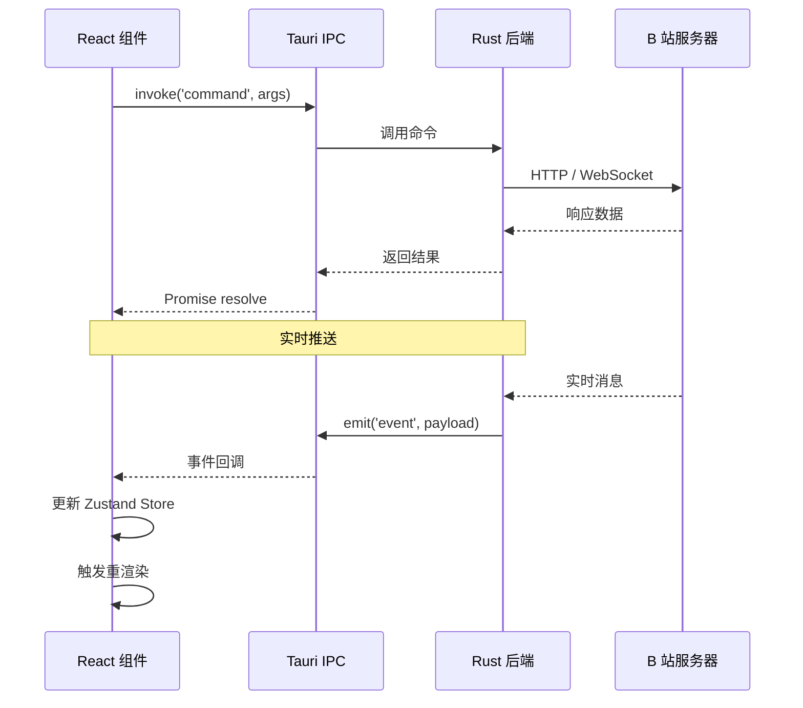
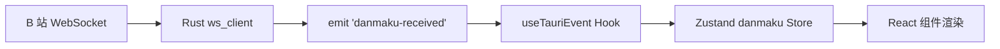
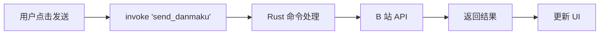

# 数据流设计

BiliDanmu 的数据流遵循 **单向数据流** 原则，前端通过 Tauri IPC 调用后端，后端通过事件（Event）向前端推送数据。

## 整体数据流



## 请求-响应模式

前端通过 `invoke` 调用后端命令，后端返回结果：

```typescript
// 前端调用
import { invoke } from '@tauri-apps/api/core'

const rooms = await invoke('search_room', { query: 'test', mode: 'name' })
```

```rust
// 后端处理
#[tauri::command]
async fn search_room(query: String, mode: SearchRoomMode) -> Result<Vec<SearchRoomResult>, String> {
    // 调用 B 站 API 或查询本地数据库
}
```

## 事件推送模式

后端通过 `emit` 向前端推送实时数据：

```rust
// 后端发送事件
app_handle.emit("danmaku-received", danmaku_data)?;
```

```typescript
// 前端监听事件
import { listen } from '@tauri-apps/api/event'

await listen<DanmakuMessage>('danmaku-received', (event) => {
  const danmaku = event.payload
  // 更新状态
})
```

## 状态管理

前端使用 **Zustand** 管理全局状态：

| Store | 职责 |
| --- | --- |
| `auth` | 账号、登录状态 |
| `room` | 当前房间、房间列表 |
| `danmaku` | 弹幕列表、过滤规则 |
| `ai` | AI 助手对话、配置 |
| `settings` | 应用设置 |

## 典型数据流示例

### 弹幕接收



### 发送弹幕



## 持久化

| 数据 | 存储方式 | 位置 |
| --- | --- | --- |
| 账号信息 | tauri-plugin-store | 应用数据目录 |
| 房间历史 | SQLite | 本地数据库 |
| 应用设置 | tauri-plugin-store | 应用数据目录 |
| 表情数据 | SQLite | 本地数据库 |
| 消息模板 | SQLite | 本地数据库 |
