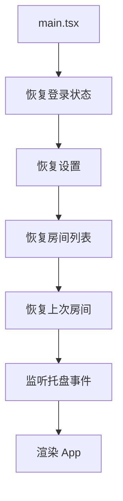

# 前端架构

BiliDanmu 的前端基于 **React 18 + TypeScript + Vite 7** 构建，采用组件化、Hooks 驱动的开发模式。

## 技术选型

| 领域 | 技术 | 说明 |
| --- | --- | --- |
| 框架 | React 18 | 函数组件 + Hooks |
| 语言 | TypeScript | 类型安全 |
| 构建 | Vite 7 | 快速开发与构建 |
| 路由 | React Router v7 | 页面路由 |
| 状态 | Zustand 5 | 轻量状态管理 |
| 服务端状态 | TanStack Query | 数据请求与缓存 |
| 样式 | TailwindCSS 3 | 原子化 CSS |
| UI 组件 | shadcn/ui | 基于 Radix 的组件库 |
| 图标 | Lucide React | 统一图标库 |
| 通知 | Sonner | Toast 通知 |

## 启动流程



## 组件设计原则

1. **单一职责**：每个组件只负责一个功能
2. **组合优于继承**：通过组合实现复杂 UI
3. **Hooks 抽离逻辑**：业务逻辑放在 Hooks 中，组件只负责渲染
4. **类型安全**：所有组件与 Hooks 都有完整的 TypeScript 类型

## Hooks 设计

| Hook | 职责 |
| --- | --- |
| `useDanmakuStream` | 管理 WebSocket 连接与弹幕数据 |
| `useAutoSend` | 自动发送弹幕逻辑 |
| `useAutoLike` | 自动点赞逻辑 |
| `useAudioPlayer` | 直播音频播放控制 |
| `useSttTranscript` | 语音转字幕驱动 |
| `useTheme` | 主题切换与跟随系统 |
| `useTauriEvent` | Tauri 事件监听封装 |
| `useWindowDock` | 窗口 Dock 折叠状态 |
| `useWindowPersistence` | 窗口大小持久化 |
| `useProxyImage` | 图片代理加载 |
| `useUpdateCheck` | 更新检查 |
| `useDividerDrag` | 可拖拽分隔条 |
| `useUiScale` | UI 缩放 |
| `useZoom` | 缩放控制 |
| `useErrorCapture` | 错误捕获 |
| `useAuth` | 账号状态管理 |
| `useDanmaku` | 弹幕操作封装 |
| `useRoom` | 房间操作封装 |

## 状态管理

使用 **Zustand** 管理全局状态，每个领域一个 Store：

```typescript
// 示例：auth store
interface AuthState {
  accounts: Credential[]
  currentAccount: Credential | null
  sendingAccountId: string | null
  addAccount: (account: Credential) => void
  removeAccount: (id: string) => void
  switchAccount: (id: string) => void
}
```

## IPC 封装

所有 Tauri IPC 调用统一封装在 `src/lib/tauri.ts` 的 `tauriCommands` 对象中，按命名空间组织：

| 命名空间 | 职责 |
| --- | --- |
| `auth` | 账号相关 |
| `room` | 房间相关 |
| `danmaku` | 弹幕相关 |
| `ws` | WebSocket 连接 |
| `ai` | AI 助手 |
| `settings` | 设置 |
| `state` | 状态查询 |
| `selections` | 选项持久化 |
| `dock` | 窗口 Dock |
| `proxy` | 图片代理 |
| `stt` | 语音识别 |
| `messageTemplate` | 消息模板 |
| `update` | 更新检查 |
| `log` | 日志 |

## 性能优化

- **虚拟列表**：弹幕列表使用虚拟滚动，避免大量 DOM 节点
- **React.memo**：对纯展示组件使用 `React.memo` 避免不必要的重渲染
- **useMemo / useCallback**：缓存计算结果与回调函数
- **懒加载**：非首屏组件使用 `React.lazy` 懒加载

## 类型定义

所有类型定义集中在 `src/types/` 目录：

| 文件 | 说明 |
| --- | --- |
| `bilibili.ts` | 房间、账号、表情、设置等类型 |
| `danmaku.ts` | 弹幕消息、礼物、醒目留言等类型 |
