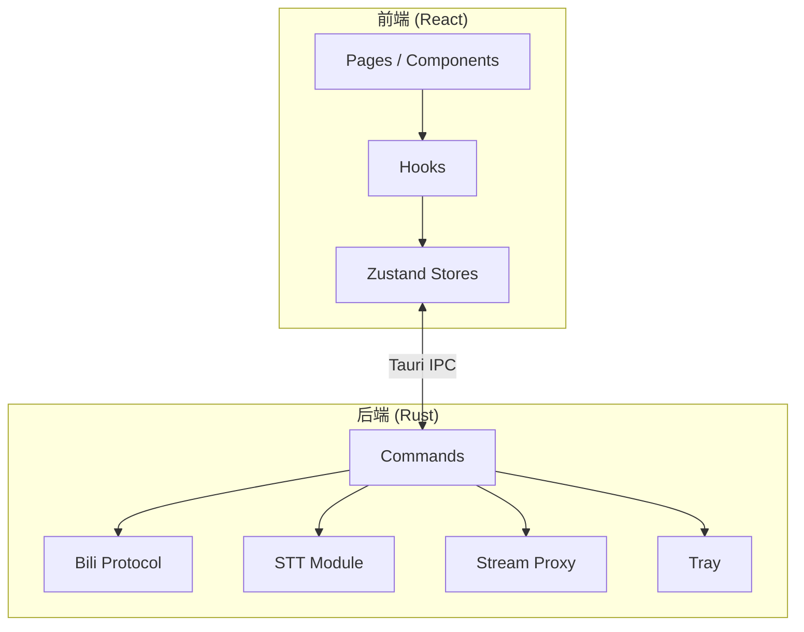

# 架构总览

BiliDanmu 采用 **前后端分离** 的架构设计，前端基于 React，后端基于 Rust，通过 Tauri 的 IPC 机制通信。

## 架构图

## 分层设计

| 层 | 职责 | 技术 |
| --- | --- | --- |
| 表现层 | 页面、组件、交互 | React 18, TailwindCSS, shadcn/ui |
| 状态层 | 全局状态、数据流 | Zustand 5, TanStack Query |
| 桥接层 | 前端与后端通信 | Tauri IPC |
| 业务层 | B 站协议、数据处理 | Rust |
| 持久化层 | 本地数据存储 | SQLite, tauri-plugin-store |

## 核心设计原则

1. **关注点分离**：前端专注 UI 与交互，后端专注协议与数据处理
2. **最小权限**：前端通过 IPC 调用后端能力，不直接访问网络 / 文件系统
3. **模块化**：功能按模块划分，便于独立开发与测试
4. **性能优先**：关键路径（弹幕渲染、音频播放）优先优化性能

## 数据流

详见 [数据流设计](/architecture/dataflow)。
