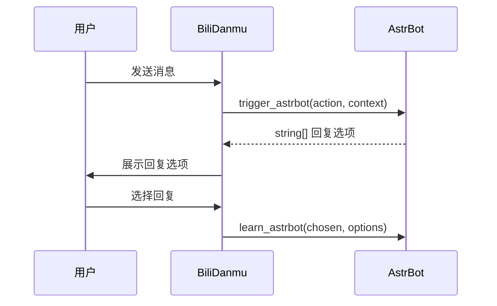

# AI 助手

BiliDanmu 集成了 AI 助手功能，对接 **AstrBot** 框架，为直播互动提供智能支持。

## 功能特点

- **多条回复选项**：AI 生成多个候选回复，可手动选择
- **自定义输入**：支持手动输入问题或指令
- **自动总结**：自动总结直播内容
- **记忆学习**：基于历史对话学习，持续优化回复
- **独立窗口**：AI 助手在独立窗口中运行

## 使用方式

1. 进入设置页面
2. 开启「AI 助手」功能
3. 配置 AstrBot 连接信息（host、httpPort、callbackPort）
4. 在「AI」页面与助手对话

## 对接 AstrBot

AstrBot 是一个开源的 AI 机器人框架。BiliDanmu 通过 API 与 AstrBot 通信，将直播间上下文发送给 AI，并展示回复。

## 典型场景

- **弹幕问答**：观众提问，AI 自动生成回复
- **内容总结**：直播结束后自动生成内容摘要
- **互动辅助**：AI 生成互动话术，提升直播氛围

## 隐私说明

- AI 对话数据会发送给 AstrBot 服务
- 请避免发送敏感个人信息
- 可在设置中随时关闭 AI 功能
