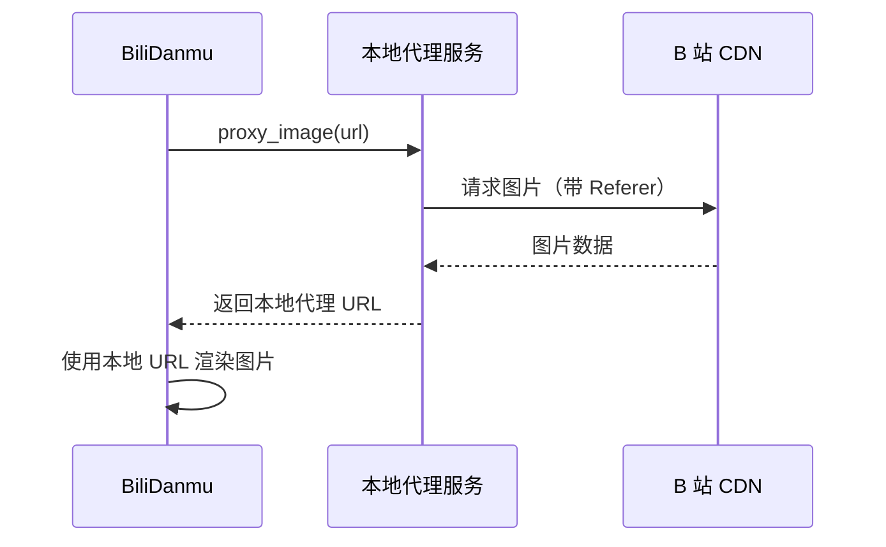

# 图片代理与缓存

BiliDanmu 内置图片代理与缓存机制，用于加载用户头像、表情、礼物图片等。

## 为什么需要代理

B 站图片 CDN 有 **Referer 防盗链** 限制，直接引用会返回 403。BiliDanmu 通过本地代理转发请求，绕过该限制。

## 代理流程

## SSRF 防护

为防止服务器端请求伪造（SSRF），代理实现了 **白名单机制**：

- 仅允许代理特定域名的图片请求
- 拒绝访问内网地址与非法域名

## LRU 缓存

代理内置 LRU 缓存，减少重复下载：

- 缓存图片数据
- 自动淘汰最近最少使用的缓存
- 支持查看缓存统计（图片数量、占用空间等）
- 支持手动清除缓存

## 缓存统计

可通过 `get_cache_stats` 命令获取缓存信息：

| 字段 | 说明 |
| --- | --- |
| `imageSize` | 图片缓存总大小 |
| `imageCount` | 图片缓存数量 |
| `emoticonPkgCount` | 表情包包数量 |
| `emoticonCount` | 表情数量 |
| `emoticonImageSize` | 表情图片总大小 |

## 表情缓存

除用户头像外，BiliDanmu 还缓存直播间表情：

- 支持清除全部表情缓存
- 支持清除指定房间的表情缓存
- 支持清除房间特定表情
