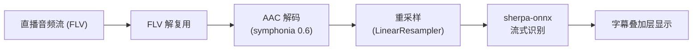
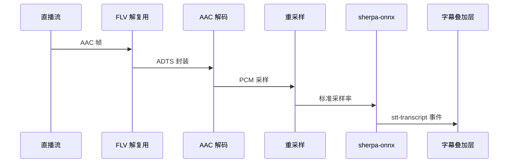

# 语音转字幕（STT）

BiliDanmu 内置基于 **sherpa-onnx** 的流式语音识别功能，可将直播音频实时转为字幕。

## 技术原理

## 使用方式

1. 进入设置页面
2. 开启「语音转字幕」功能
3. 进入直播间后，字幕会自动叠加在弹幕窗口上

## 功能特点

- **本地推理**：基于 sherpa-onnx 1.13，无需联网，保护隐私
- **流式识别**：实时识别，低延迟
- **字幕叠加**：字幕以叠加层形式显示在弹幕窗口
- **模型切换**：支持切换不同识别模型
- **同步延迟**：可调节字幕同步延迟
- **按需开启**：可在设置中随时开启 / 关闭

## 识别流程

## 性能提示

- 语音识别会占用一定的 CPU 资源
- 如遇到性能问题，可尝试关闭其他占用 CPU 的应用
- 建议在较新的设备上启用此功能

## 常见问题

**Q：字幕延迟较高？**

A：流式识别通常延迟较低，如延迟过高请检查 CPU 占用情况，或调节同步延迟。

**Q：识别准确率不高？**

A：准确率受音频质量、背景噪音等因素影响，建议在安静环境下使用，或切换更大型号。
