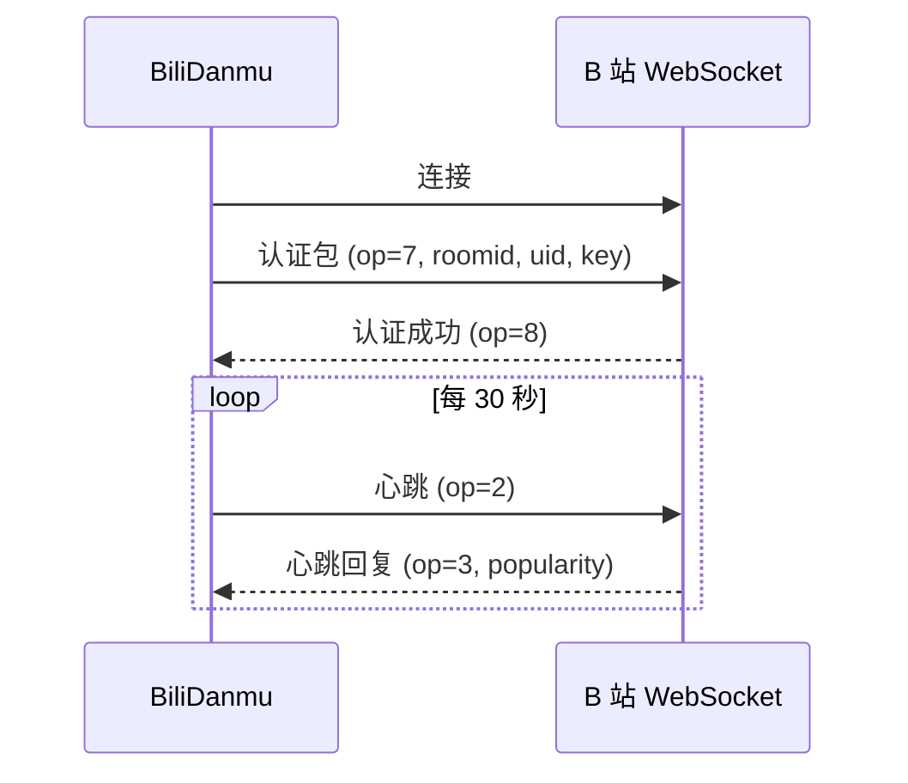

# 技术调研

本章记录 BiliDanmu 开发过程中的技术调研与方案选型。

## 弹幕协议调研

### B 站 WebSocket 弹幕协议

B 站直播弹幕基于 WebSocket 协议，使用自定义二进制帧格式：

- **包头**：16 字节，包含包长度、协议版本、操作码、序列号
- **包体**：JSON 或压缩数据
- **操作码**：
  - `2`：心跳
  - `3`：心跳回复（包含在线人数）
  - `5`：业务消息（弹幕、礼物等）
  - `8`：房间认证成功

### 认证流程

### 数据压缩

B 站支持多种压缩方式：

| 压缩方式 | 协议版本 | 说明 |
| --- | --- | --- |
| 无压缩 | 0 | 纯 JSON |
| deflate | 1 | zlib 压缩 |
| brotli | 2 | Brotli 压缩（体积更小） |

BiliDanmu 优先使用 Brotli 压缩。

### 消息类型

| 消息类型 | 说明 |
| --- | --- |
| `DANMU_MSG` | 普通弹幕 |
| `SEND_GIFT` | 礼物 |
| `INTERACT_WORD` | 进场 |
| `SUPER_CHAT_MESSAGE` | 醒目留言 |
| `GUARD_BUY` | 上舰 |

## 直播流调研

### 流格式

| 格式 | 说明 | 支持情况 |
| --- | --- | --- |
| FLV | 传统格式，广泛支持 | ✅ |
| TS | HLS 切片 | ✅ |
| fMP4 | 基于 MSE 播放 | ✅ |

### 播放方案

| 方案 | 优点 | 缺点 |
| --- | --- | --- |
| video.js | 成熟 | 体积大 |
| hls.js | HLS 专用 | 仅支持 HLS |
| mpegts.js | FLV/TS/fMP4 全支持 | 维护一般 |

BiliDanmu 选择 **mpegts.js**，支持全格式播放。

## 语音识别调研

### 方案对比

| 方案 | 优点 | 缺点 |
| --- | --- | --- |
| sherpa-onnx | 本地、跨平台、流式 | 模型体积较大 |
| Whisper | 准确率高 | 体积大、速度慢 |
| 云端 API | 准确率高 | 需联网、隐私风险 |

BiliDanmu 选择 **sherpa-onnx 1.13**，兼顾本地推理与流式识别。

## 桌面框架调研

### 方案对比

| 框架 | 优点 | 缺点 |
| --- | --- | --- |
| Tauri 2 | 轻量、原生、安全 | Rust 学习曲线 |
| Electron | 成熟、生态好 | 体积大、内存高 |
| Flutter Desktop | 跨平台一致 | 生态较新 |

BiliDanmu 选择 **Tauri 2**，追求轻量与原生体验。

## 状态管理调研

### 方案对比

| 方案 | 优点 | 缺点 |
| --- | --- | --- |
| Zustand | 轻量、简单 | 功能较少 |
| Redux | 成熟、生态好 | 模板代码多 |
| Jotai | 原子化 | 学习曲线 |

BiliDanmu 选择 **Zustand 5**，轻量且足够满足需求。

## 后续调研

- [ ] 弹幕渲染性能优化（Canvas / WebGL）
- [ ] 多平台支持（macOS / Linux）
- [ ] 插件系统
